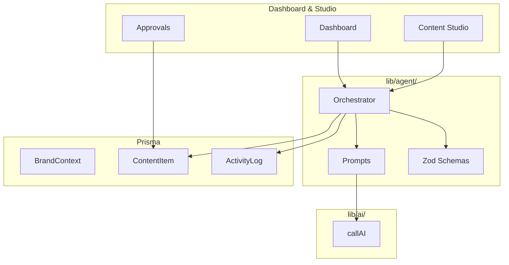

# TekMarketing

### Open Core AI Marketing Agent by [TEKHERO](https://tekhero.us)

[](https://github.com/kheron/TekMarketing/actions/workflows/ci.yml)
[](LICENSE)
[](https://www.typescriptlang.org/)
[](https://nextjs.org/)
[](https://www.prisma.io/)

**Strategic AI marketing that plans, generates, and proposes — with human approval on every publish.**

[Live Demo](#live-demo) · [Quick Start](#quick-start-personal--non-commercial) · [Commercial Licensing](COMMERCIAL.md) · [Deployment](DEPLOYMENT.md) · [Roadmap](ROADMAP.md)

---

## Hero — Why TekMarketing

Marketing teams do not need another chatbot that spams drafts. They need an **agent that thinks like a manager**: loads brand context, reviews recent performance, proposes high-ROI content, and **waits for human approval** before anything goes live.

TekMarketing is TEKHERO's open-core answer — production-grade agent engineering you can self-host for learning and evaluation, with a clear path to **commercial licensing** for business, agency, and client deployments.

| For recruiters & engineers | For business buyers |
|---------------------------|-------------------|
| Zod-structured agent outputs | Human-in-the-loop by design |
| Orchestrator-centric architecture | Multi-platform Content Studio |
| Full audit trail (`ActivityLog`, `AgentRun`) | Multi-provider AI (BYOK) |
| Clean TypeScript + Prisma + Next.js 16 | Managed hosting & white-label via TEKHERO |

---

## Open Core vs. Commercial

| | **Open Core** (this repo) | **TEKHERO Commercial** |
|---|---------------------------|------------------------|
| **Use case** | Personal, education, non-profit, evaluation | Business production, clients, SaaS, white-label |
| **Price** | Free | From $199/mo — [see tiers](COMMERCIAL.md) |
| **Planning agent + Studio** | ✓ | ✓ |
| **HITL approvals** | ✓ | ✓ |
| **Self-host** | ✓ (non-commercial) | ✓ (licensed) |
| **Managed SaaS** | — | ✓ |
| **White-label** | — | Enterprise |
| **Priority support** | Community | ✓ |
| **License key** | Not required | `TEKHERO_LICENSE_KEY` |

> **Commercial use** (SaaS hosting, client delivery, white-label, or production use by revenue-generating businesses) requires a paid TEKHERO license.  
> Contact **[info@tekhero.us](mailto:info@tekhero.us)** · [COMMERCIAL.md](COMMERCIAL.md)

---

## Live Demo

**Public demo:** _Deploy in progress — [self-host instructions](DEPLOYMENT.md) available now._

Explore locally without API keys:

```powershell
git clone https://github.com/kheron/TekMarketing.git
cd TekMarketing
npm install --legacy-peer-deps
npx prisma migrate dev
npm run db:seed
npm run dev
```

Open **http://localhost:3000** — demo brand **TekFlow Analytics** with pending approvals pre-loaded.

---

## Quick Start (Personal & Non-Commercial)

### Prerequisites
- Node.js 20+
- At least one AI provider key for live agent runs (xAI recommended)

### Setup

```powershell
npm install --legacy-peer-deps
npx prisma migrate dev
cp .env.example .env.local   # configure keys
npm run dev
```

### Environment

```env
DATABASE_URL="file:./dev.db"
SETTINGS_ENCRYPTION_KEY=<64-char-hex>
XAI_API_KEY=your_key_here
```

### Docker

```powershell
docker compose up --build
```

### Tests

```powershell
npm test && npm run lint && npm run build
```

---

## Commercial & Self-Hosting for Business

For production business use, client delivery, or agency deployments:

1. **[Request a license](mailto:info@tekhero.us)** — [COMMERCIAL.md](COMMERCIAL.md)
2. Follow **[DEPLOYMENT.md](DEPLOYMENT.md)** (Postgres, Vercel, Docker)
3. Set commercial env vars:

```env
COMMERCIAL_MODE=true
TEKHERO_LICENSE_KEY=your_license_key
TEKHERO_EDITION=commercial
TELEMETRY_OPT_IN=false   # opt in only with policy consent
```

---

## Features

### Autonomous Planning Agent
- Brand context + 14-day activity memory before every cycle
- Strategic X/LinkedIn proposals with confidence + reasoning
- Zod validation with sanitization fallback
- Immutable audit trail

### Content Studio
- YouTube, TikTok, Instagram, X, LinkedIn, Facebook
- OpenAI, Anthropic, xAI, Google Gemini
- Image generation (DALL·E 3, Grok Imagine, Gemini)
- Regenerate with human feedback

### Human-in-the-Loop
- Draft + agent reasoning side-by-side
- Approve · reject · regenerate
- Calendar scheduling view
- Encrypted API key storage

---

## Architecture



**Rules:** Agent logic lives only in `lib/agent/`. The orchestrator is the single coordination point. No publish path bypasses human approval. See [AGENTS.md](AGENTS.md).

---

## Screenshots

| Dashboard | Content Studio | Approvals |
|-----------|----------------|-----------|
| _Add `public/screenshots/dashboard.png`_ | _Add `content-studio.png`_ | _Add `approvals.png`_ |

Capture guide: [public/screenshots/README.md](public/screenshots/README.md)

---

## Tech Stack

Next.js 16 · React 19 · TypeScript · Tailwind 4 · Prisma · Zod · Inngest · Vitest

---

## Project Structure

```
lib/agent/      Orchestrator, prompts, Zod types
lib/ai/         callAI(), providers, usage tracking
lib/config/     TEKHERO edition & license stubs
prisma/         Schema, migrations, seed
app/            Routes & UI (no agent logic)
```

---

## Roadmap

See **[ROADMAP.md](ROADMAP.md)** for open-core vs. commercial feature split.

**Near term:** public demo deploy · expanded tests · provider retry/fallback · Inngest cron

---

## Contributing

[CONTRIBUTING.md](CONTRIBUTING.md) — we welcome open-core improvements; commercial extensions may be maintained separately by TEKHERO.

---

## License

**[TEKHERO Open Core License 1.0](LICENSE)** — free for personal, educational, and non-commercial use.

**Commercial use** requires a paid license: **[info@tekhero.us](mailto:info@tekhero.us)** · [COMMERCIAL.md](COMMERCIAL.md)

---

<p align="center">
  <strong>Built by <a href="https://tekhero.us">Korey Heron</a> / <a href="https://tekhero.us">TEKHERO</a></strong><br>
  <a href="https://tekhero.us">tekhero.us</a> ·
  <a href="https://www.linkedin.com/in/koreyheron">LinkedIn</a> ·
  <a href="https://github.com/kheron/TekMarketing">GitHub</a> ·
  <a href="COMMERCIAL.md">Commercial</a>
</p>